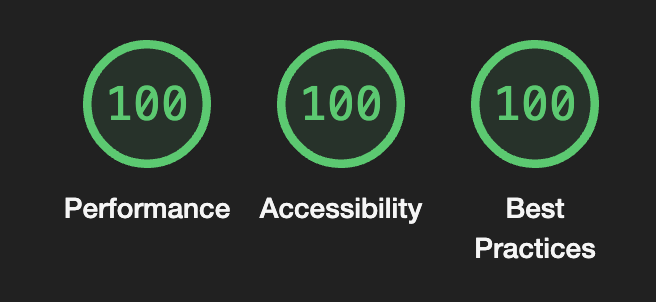

# Nextjs Boilerplate

- Bun/Yarn/NPM/PNPM

- NextJs 14
- Tailwindcss + shadcn

- Prettier
- Eslint

- Playwright e2e test
- Vitest unit test

- React Hook Form
- Zod

src/ work in progress to add more sandbox stuff to validate the Webvitals

## Live app

[Link to the web app](https://joaopaulocmarra-ssr.vercel.app/)

## Scripts

`bun dev` to run dev mode
`bun run build` to build
`bun start` to run the build as production

`bun test:unit` unit test
`bun test:e2e` end to end test

`bun lint` to run eslint on the codebase
`bun format` to run prettier on the codebase

## Web Vitals / Lighthouse

