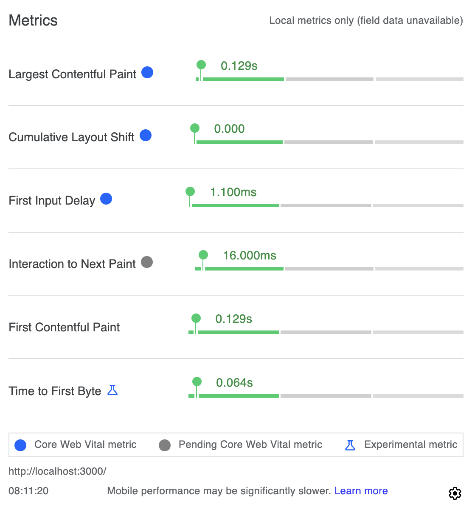

# Nextjs Boilerplate

- Yarn

- NextJs 14
- Tailwindcss

- Prettier
- Eslint

- Playwright e2e test
- Vitest unit test

src/ work in progress to add more sandbox stuff to validate the Webvitals

## Scripts

`yarn dev` to run dev mode
`yarn build` to build
`yarn start` to run the build as production

`yarn test:unit` unit test
`yarn test:e2e` end to end test

`yarn lint` to run eslint on the codebase
`yarn format` to run prettier on the codebase

## Web Vitals

